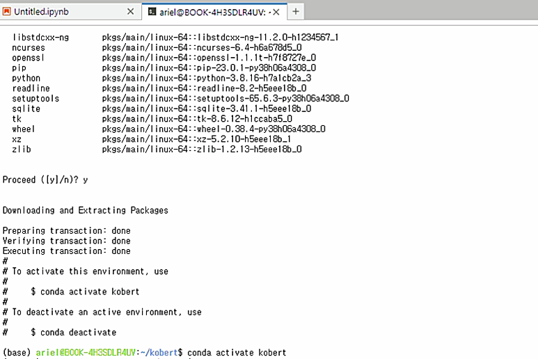
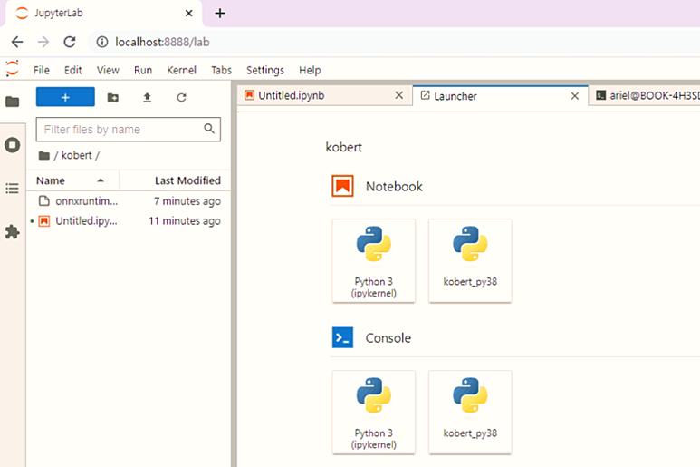

## 주피터 노트북에 가상환경을 연결하는 방법 알아보기
---
파이썬(Python) 개발에 흔히 사용되는 통합개발환경(IDE)으로 주피터 노트북(Jupyter Notebook)을 빼놓을 수 없습니다. 웹앱 기반이라 어디서나 주소만 입력하면 접속이 가능하고, 각 셀 단위로 코드를 실행할 수 있기 때문이지요. 그런데, 주피터 노트북은 다른 IDE에 비해서 현재 컴퓨터에 설치된 가상환경을 마음대로 오갈 수 있는 기능을 찾아보기 어려운 편입니다. 그래서, 이번에는 파이썬 개발 프로젝트 때문에 conda 가상환경을 만들었을 때 주피터 노트북 (또는 주피터 랩) 에 연결할 수 있는 방법을 알아보도록 하겠습니다.
</p></br></br>


저는 자연어 처리 프로그램을 하나 만들어보기 위해 kobert 라고 하는 가상환경을 만들어 봤습니다. conda 가상환경 생성은 아래와 같이 터미널 명령어를 입력할 수 있지만, 만약 다른 이름과 파이썬 버전을 원하는 분들은 취향에 맞게 조절해 주세요.
</p></br></br>


```bash
$ conda create -n kobert python=3.8
```
</p></br></br>


위와 같이 터미널 명령어를 입력하면, 아래와 같이 무언가가 출력되는데, 계속 진행할건지 물어보는 절차에서 y 한번만 입력해 주면 별 탈 없이 설치가 진행됩니다. 마지막에 `$ conda activate` 명령어를 소개하는 출력이 나오면, 정상적으로 가상환경이 설치되었다고 보면 되겠습니다.
</p></br></br>


<center></center>
</p></br></br>


하지만, 이렇게 conda 가상환경을 설치했다고 해도 주피터 노트북에서는 이 가상환경을 바로 인식할 수 없습니다. 이 때는 크게 아래 두 가지 방법을 고민하는데요,
</p></br></br>


1. 새로 설치한 가상환경에 주피터 노트북을 또 설치하거나,
1. 기존에 설치한 주피터 노트북에 새로운 가상환경을 연결하는 방법이죠.
</p></br></br>


전자의 방법은 단순하게 해결 가능하니, 이번에는 후자의 방법을 이용해 보겠습니다. 주피터 노트북에 연결하고 싶은 가상환경을 활성화한 다음, ipykernel을 설치해 줍니다. 만약 설치되어 있다면 이 과정은 건너뛰어주세요. 만약 주피터 노트북이 설치되지 않았다면, 주피터 노트북도 별도로 설치해 주세요.
</p></br></br>


```bash
# 가상환경을 실행하고, ipykernel 설치하기
$ conda activate 가상환경이름
$ pip install ipykernel
```
</p></br></br>


다음으로는, ipykernel을 이용해서 기존에 설치된 주피터 노트북에 원하는 가상환경을 원하는 이름으로 연결해 줍니다. 이 코드는 아래와 같이 입력해 주세요.
</p></br></br>


```bash
$ python -m ipykernel install --user --name kobert --display-name "kobert-py38"
```
</p></br></br>


이렇게 입력하면, kobert 가상환경이 kobert-py38이라는 이름으로 주피터 노트북에 연결된 것을 확인할 수 있습니다. 저는 주피터 랩으로 보는 화면이라 약간 다르지만, 주피터 노트북에서는 New 버튼을 눌러 새로운 문서를 생성하는 화면에 연결한 가상환경이 보이게 됩니다.
</p></br></br>


<center></center>
</p></br></br>


만약에 내가 만든 가상환경 이름이 kobert가 아니라면, 위 명령어에서 kobert 부분을 설치한 가상환경 이름으로 바꿔주시고, 주피터에서 보고 싶은 가상환경 이름이 kobert-py38이 아니라면 "kobert-py38" 부분을 원하는 값으로 바꿔 주시기 바랍니다.
