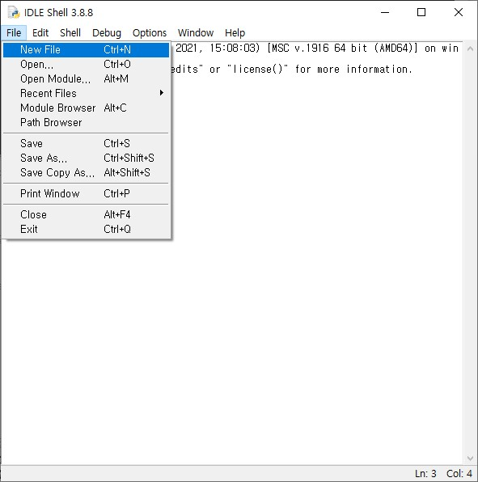
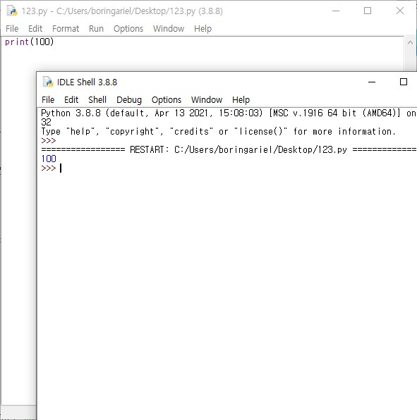
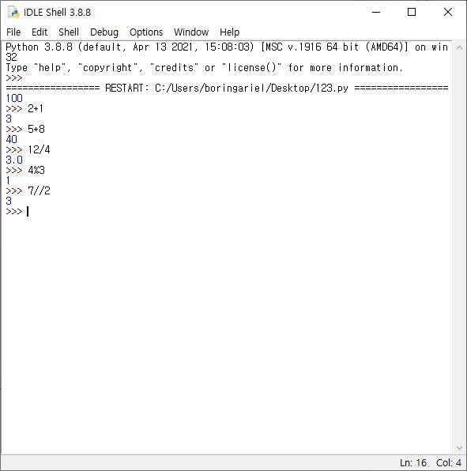
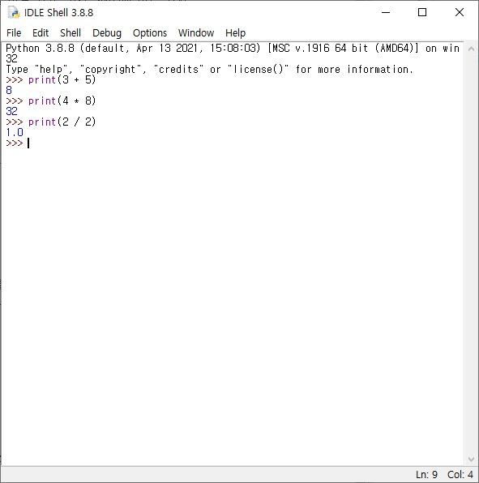

## 파이썬 프로그래밍의 기초를 알아보자

---

다양한 프로그래밍 언어가 기본적인 계산이 가능하지만, 파이썬은 인터프리터 언어의 특성상 계산기처럼 이용하기가 쉬운 편입니다. 그런 의미에서, 이번에는 파이썬 구문도 익힐 겸 기본적인 연산자를 사용하는 법을 배워보며 계산기처럼 써 보기로 합시다.

파이썬 프로그래밍을 시작하기 위해, 이전에 설치했던 IDLE을 실행해 봅시다. 이 창에 그대로 코드를 적고 실행해도 되지만, 이렇게 하면 공부한 코드를 나중에 확인하기 어렵기 때문에 따로 파일을 저장하는게 좋습니다. 파이썬은 **\*.py** 형식의 파일로 코드를 저장할 수 있으므로, **File - New File** 메뉴를 선택해 새로운 파일을 만들어봅시다.



새로 파일을 만들었으면, 이전에 Hello, World!를 출력했을 때와 같은 방법으로 이용하면 됩니다. 우선 이전에 사용했던 **print()** 함수부터 살펴보고 시작하겠습니다.

---

## print() 함수

---

**print()** 함수는 괄호 안의 값을 출력하는 명령으로, 모든 출력값을 괄호 안에 적으면 인터프리터의 출력 창에 표기됩니다.

```
print(100)
```

위 코드를 입력한 다음, F5를 눌러 실행해 봅시다. 파일을 저장할 것인지 대화창이 뜨는데, 적당한 경로에 저장한 뒤에는 출력 창이 나타납니다. 출력 창에 숫자 100이 출력되는 것을 확인할 수 있습니다. 문자를 출력할 때는 따옴표 안에, 숫자를 출력할 때는 따옴표 없이 그냥 적는걸 잊지 마세요.



---

## 연산자

---

연산자란 계산기의 계산기호와 비슷한 역할을 한다고 생각하면 이해하기 좋습니다. 이 글의 제목처럼 파이썬을 계산기 대용으로 사용하기 위해 수도 있죠. 그러면 바로 파이썬을 계산기로 활용해 봅시다. 아까처럼 새로운 파일을 만들어도 되고, IDLE Shell에 바로 쳐서 확인해도 됩니다. 아래 코드를 한 줄씩 쳐서 결과를 확인해 봅시다.

```
2 + 1
5 * 8
12 / 4
4 % 3
7 // 2
```

파이썬 쉘에서 각각 3, 40, 3.0, 1, 3 의 값이 출력되는 것을 확인할 수 있습니다.



그런데, 사칙연산 연산자는 익숙하지만 **%**나 **//** 같은 기호는 생소할 수 있지요. **%**는 나눗셈의 몫을 구하는 기호이며, **//**는 나눗셈의 나머지를 구하는 기호이니 참고해 주시기 바랍니다.

---

## print문을 이용한 연산자 활용

---

연산자는 함수 안에서도 사용할 수 있습니다. 앞서 배웠던 **print()** 함수가 함수이니 연산자를 동시에 사용해  
숫자를 계산한 뒤 출력하는 간단한 프로그램을 만들 수 있습니다. 참고로, 소스코드 중 **#**으로 시작하는 문장은  
주석이며, 실제 프로그램에서는 그 줄이 통째로 실행되지 않으니 공부할 때 활용해 보시기 바랍니다.

이번에도 아래 코드를 한 줄씩 쳐서 결과를 확인해 봅시다.

```
# (이 줄은 주석이므로 실행되지 않습니다) 파이썬 연산자를 함수 안에 쓴 프로그램
print(3 + 5)
print(4 * 8)
print(2 / 2)
```

출력 창에 숫자 8, 32, 1이 출력되는 것을 확인할 수 있습니다.



이처럼 **print()** 함수와 연산자를 함께 이용하면 귀찮은 계산을 대신 해 주는 프로그램을 만들 수 있습니다.