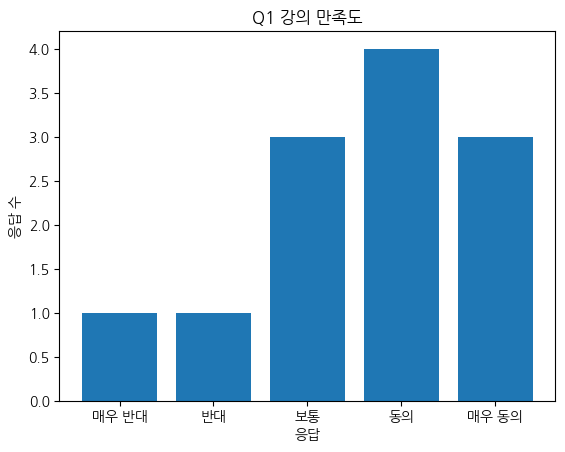
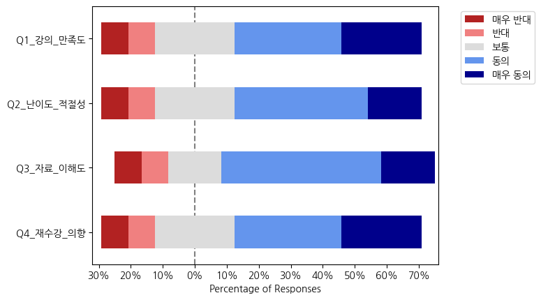

<center></center>

## **리커트 척도를 이용한 설문 시각화하는 파이썬 코드 알아보기 (plot\_likert)**

---

#### **요약**

리커트 척도로 작성된 설문 데이터를 파이썬으로 시각화하려면 어려운 점이 많습니다. 주요 시각화 패키지에서는 리커트 척도 데이터를 인식하는 기능이 없기 때문이지요. 그래서 이번에는 파이썬에서 리커트 척도 데이터를 별도 변환 없이 시각화할 수 있는 **plot\_likert**를 알아보도록 하겠습니다. 전체 코드를 예제와 함께 설명드릴 예정이니, 이 코드를 참조해서 강의평가나 만족도 조사 결과를 퍼센트 기반 그래프로 깔끔하게 표현해 보도록 합시다.

---

#### **설문 데이터 시각화는 막대 그래프가 어울리지 않는 이유**

<center></center>

강의평가나 만족도 조사를 진행하면 대부분 엑셀이나 CSV 형태로 설문 결과가 쌓인다. 여기까지는 괜찮은데, 이를 파이썬으로 시각화하려고 하면 갑자기 난이도가 올라간다. 특히 매우 동의, 동의, 보통, 반대, 매우 반대처럼 리커트 척도를 사용하는 경우에는 단순한 막대그래프로는 의도가 잘 전달되지 않기 때문이지요. 이는 여러 항목을 비교하거나 비율을 표현하기 어려운 막대그래프의 한계 때문입니다. 그래서 많은 사람들이 “데이터는 있는데 도표를 못 그리겠다”는 상황에 빠지곤 하지요.

---

#### **리커트 척도 시각화를 위한 plot\_likert**

리커트 설문은 긍정과 부정이 중심을 기준으로 나뉘는 구조이기 때문에 일반적인 시각화 방식과는 결이 다릅니다. 이 문제를 해결해 주는 파이썬 라이브러리가 **plot\_likert**예요. plot\_likert는 설문 응답을 자동으로 집계해 문항별 리커트 차트를 만들어 주기 때문에, 전처리 관련 스트레스가 크게 줄어든답니다. 이번 예제에서는 plot\_likert를 이용한 시각화와, koreanize\_matplotlib을 이용한 한국어 폰트 설정을 통해 데이터를 최대한 건드리지 않는 것을 목표로 하겠습니다.

| **Q1\_강의\_만족도** | **Q2\_난이도\_적절성** | **Q3\_자료\_이해도** | **4\_재수강\_의향** |
| --- | --- | --- | --- |
| 매우 동의 | 보통 | 동의 | 매우 동의 |
| 동의 | 동의 | 동의 | 동의 |
| 보통 | 동의 | 매우 동의 | 동의 |
| 동의 | 매우 동의 | 동의 | 보통 |
| 매우 동의 | 동의 | 보통 | 동의 |
| 보통 | 보통 | 동의 | 매우 동의 |
| 동의 | 반대 | 매우 동의 | 동의 |
| 반대 | 동의 | 보통 | 보통 |
| 매우 동의 | 동의 | 반대 | 반대 |
| 보통 | 매우 동의 | 동의 | 매우 동의 |
| 동의 | 보통 | 매우 반대 | 매우 반대 |
| 매우 반대 | 매우 반대 | 동의 | 보통 |

**\[데이터 예제\]** 리커트 5점 척도 기준으로 작성된 가상의 강의 만족도 평가

---

#### **파이썬 코드 예제**

먼저 필요한 라이브러리를 불러옵니다. **pandas**는 표 형태의 데이터 처리용으로 사용되며, **matplotlib**은 그래프 출력용입니다. 다만, matplotlib은 그래프 이미지 저장 및 편집이 필요하지 않은 경우 생략할 수 있습니다. **koreanize\_matplotlib**은 한글 깨짐 방지용으로 불러옵니다. **plot\_likert**는 리커트 척도 시각화용으로 불러옵니다.

```
import pandas as pd
import matplotlib.pyplot as plt
import koreanize_matplotlib
from plot_likert import plot_likert
```

다음으로 설문 응답 데이터를 작성하거나 불러옵니다. 여기서 이용한 데이터는, 응답자 정보가 행으로 배정되어 있고 문항 정보가 열에 배정되도록 구성했습니다. 여기서는 가상의 강의평가 데이터를 예로 들었지만, 여러분들이 원하는 데이터를 불러오거나, 값을 일부 바꿔 적어도 무방합니다.

```
data = pd.DataFrame({
    "Q1_강의_만족도": [
        "매우 동의", "동의", "보통", "동의", "매우 동의",
        "보통", "동의", "반대", "매우 동의", "보통",
        "동의", "매우 반대"
    ],
    "Q2_난이도_적절성": [
        "보통", "동의", "동의", "매우 동의", "동의",
        "보통", "반대", "동의", "동의", "매우 동의",
        "보통", "매우 반대"
    ],
    "Q3_자료_이해도": [
        "동의", "동의", "매우 동의", "동의", "보통",
        "동의", "매우 동의", "보통", "반대", "동의",
        "매우 반대", "동의"
    ],
    "Q4_재수강_의향": [
        "매우 동의", "동의", "동의", "보통", "동의",
        "매우 동의", "동의", "보통", "반대", "매우 동의",
        "매우 반대", "보통"
    ]
})
```

그다음 리커트 척도의 순서를 정의합니다. 여기서는 매우 반대 - 반대 - 보통 - 동의 - 매우 동의 순서로 작성했는데, 이 순서를 반대로 적으면 그래프가 반대로 그려지므로 참고해 주세요.

```
korean_agree_scale = [
    "매우 반대",
    "반대",
    "보통",
    "동의",
    "매우 동의"
]
```

마지막으로 plot\_likert 함수를 호출합니다. **plot\_percentage** 매개변수를 **True**로 입력하면, 응답 수 대신 퍼센트 기준으로 그래프가 표시됩니다.

```
plot_likert(data, korean_agree_scale, plot_percentage=True)
plt.show()
```

<center></center>

이 코드만 실행하면 문항별로 매우 반대부터 매우 동의까지 균형 잡힌 리커트 차트가 자동으로 생성됩니다.

---

#### **알아두면 좋은 팁**

이 그래프는 중립 응답이 가운데로 오도록 설정되기 때문에, 설문 결과의 긍정/부정 비율에 따라 그래프가 한 쪽으로 치우칠 수 있습니다. 또한, 문항 이름이 너무 길면 그래프 가독성이 떨어지므로, 문항 이름을 간결하게 정리하는 것이 좋습니다.

만약 한국어가 깨질 경우에는 matplotlib을 불러오는 코드 아래에 koreanize\_matplotlib을 불러오는 코드가 있는지 체크해 주세요. koreanize\_matplotlib을 불러온 뒤 matplotlib을 불러오면 한국어가 정상적으로 표시되지 않습니다.

---

plot\_likert를 활용하면 설문 결과를 설명하는 데 드는 수고가 크게 줄어듭니다. 특히 파이썬으로 강의평가나 만족도 조사를 분석하는 사람이라면 한 번쯤 꼭 써볼 만한 도구랍니다. 오늘 소개한 코드만 잘 정리해 두어도 다음 설문 분석이 훨씬 편해질 거예요.